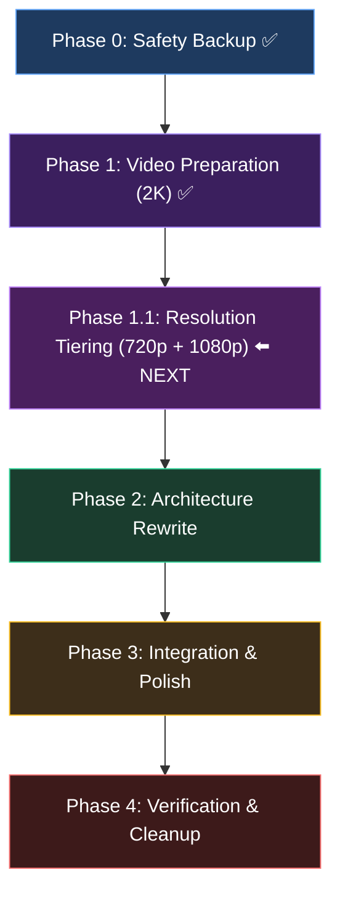

# 🎬 Implementation Plan v2: Hybrid Video + Canvas Scroll System

> **Goal**: Migrate from 597 WebP image-sequence (8.8 GB decoded memory) to hardware-accelerated video scrubbing with adaptive resolution tiering (~17-64 MB download per user, ~80 MB runtime memory).
> 
> **Project**: `c:\Users\fahed\Projects\super awesome portfolio`  
> **FFmpeg**: `C:\Users\fahed\AppData\Local\Microsoft\WinGet\Packages\Gyan.FFmpeg_Microsoft.Winget.Source_8wekyb3d8bbwe\ffmpeg-9.0-full_build\bin\ffmpeg.exe`

---

## Source Video Properties (discovered via ffprobe)

| Scene | File | Duration | Native FPS | Native Frames | Resolution | Size |
|-------|------|----------|-----------|---------------|------------|------|
| scene_1 | `raw_videos/scene 1.mp4` | 7.33s | 60 | 440 | 2560×1440 | 32.2 MB |
| scene_2 | `raw_videos/scene 2.mp4` | 6.20s | 60 | 372 | 2560×1440 | 22.3 MB |
| scene_3 | `raw_videos/scene 3.mp4` | 6.37s | 60 | 382 | 2560×1440 | 22.5 MB |
| **Total** | | **19.9s** | | **1194** | | **77.0 MB** |

### Phase 1 Output (2K all-intra, already completed)

| File | Size |
|------|------|
| `public/videos/scene_1.mp4` | 26.04 MB |
| `public/videos/scene_2.mp4` | 18.02 MB |
| `public/videos/scene_3.mp4` | 19.92 MB |
| **Total** | **63.98 MB** |

> [!NOTE]
> The original extraction used every-other-frame (30fps). With video scrubbing we get **all 60 native frames** — twice the temporal resolution for free. This means smoother scrolling than the current WebP approach.

---

## Architecture Overview

```
BEFORE (Image Sequence):
┌─────────────────────────────────────────────────┐
│ Page Load                                       │
│   └─ Fetch 597 WebP images (68 MB network)      │
│   └─ Decode ALL into HTMLImageElement (8.8 GB!)  │
│   └─ On scroll → drawImage(images[frameIdx])     │
└─────────────────────────────────────────────────┘

AFTER (Video Scrubbing + Adaptive Resolution):
┌──────────────────────────────────────────────────────┐
│ Page Load                                            │
│   └─ Detect screen: innerWidth × devicePixelRatio    │
│   └─ Select tier: 720p / 1080p / 2K                 │
│   └─ Load ONLY that tier's 3 MP4s (~17-64 MB)       │
│   └─ Browser hardware-decodes on demand (~40-80 MB) │
│   └─ On scroll → video.currentTime = t              │
│   └─ On seeked → drawImage(video, ...)              │
│   └─ requestVideoFrameCallback for precision        │
└──────────────────────────────────────────────────────┘
```

### Resolution Tiers

| Tier | Resolution | Effective Pixels | Est. Total Download | Who Gets It |
|------|-----------|-----------------|--------------------|----|
| `720p` | 1280×720 | 0.92M | **~17 MB** | Mobile, tablets, screens ≤ 1280px effective |
| `1080p` | 1920×1080 | 2.07M | **~36 MB** | Standard laptops/desktops ≤ 1920px effective |
| `2k` | 2560×1440 | 3.69M | **~64 MB** | QHD monitors, 4K displays, high-DPI |

**Each user downloads ONLY their tier** — a mobile user never touches the 2K files.

### Key Technical Decisions

1. **All-Intra Re-encoding**: Every frame is a keyframe (`-g 1`). This makes seeking to any frame instant (no need to decode from previous keyframe). File size increases ~2-3x vs normal encoding, but the total is still only ~15-25 MB per video (far less than 68 MB WebP).

2. **`requestVideoFrameCallback`**: Modern API that fires exactly when a new video frame is presented. Far more precise than `seeked` event. Fallback to `seeked` for older browsers.

3. **Multi-video architecture**: One `<video>` per scene. Only the active scene's video has its `currentTime` updated. Inactive videos are paused and consume zero decode resources.

4. **Canvas 2D with `{ alpha: false }`**: Same as current, but the source is a `<video>` element instead of an ``. `drawImage()` works identically with video sources and is GPU-accelerated.

5. **MP4/H.264**: Universal browser support, hardware decode on all platforms including mobile.

6. **Adaptive resolution tiering**: Client-side JS detects `window.innerWidth * devicePixelRatio` at load time and selects the smallest tier that fully covers the screen. This reduces bandwidth by 42-73% for the majority of users while keeping pixel-perfect quality for high-end displays.

---

## Phase 0 — Safety Backup ✅ COMPLETED

### Agent Prompt

```
You are a file system operations agent. Your ONLY task is to create a complete backup
of the project before any modifications begin.

STEPS:
1. Create a backup directory at: c:\Users\fahed\Projects\super awesome portfolio_BACKUP
2. Copy the ENTIRE contents of "c:\Users\fahed\Projects\super awesome portfolio" to the backup,
   EXCLUDING: node_modules, .next, .git
3. Verify the backup by comparing file counts between source and backup (excluding the 3 dirs above).
4. Report: total files copied, total size, and confirmation that the backup is complete.

IMPORTANT:
- Do NOT modify any files in the original project.
- Do NOT copy node_modules or .next (they can be regenerated with npm install / npm run build).
- Use robocopy or Copy-Item with -Recurse for reliability.

Working directory: c:\Users\fahed\Projects\super awesome portfolio
```

### Expected Output
- Backup at `c:\Users\fahed\Projects\super awesome portfolio_BACKUP`
- All source files, components, public assets, raw_videos, config files preserved
- Verification log confirming file count match

---

## Phase 1 — Video Preparation (FFmpeg Re-encoding) ✅ COMPLETED

### Agent Prompt

```
You are a media engineering agent. Your task is to re-encode 3 source MP4 videos for
optimal scroll-linked canvas scrubbing with frame-accurate seeking.

FFmpeg location: C:\Users\fahed\AppData\Local\Microsoft\WinGet\Packages\Gyan.FFmpeg_Microsoft.Winget.Source_8wekyb3d8bbwe\ffmpeg-9.0-full_build\bin\ffmpeg.exe

PROJECT DIR: c:\Users\fahed\Projects\super awesome portfolio

STEP 1: Create output directory
  mkdir "public\videos"

STEP 2: Re-encode each video with ALL-INTRA keyframes for instant frame-accurate seeking.
Run these 3 commands (use the full ffmpeg path):

For scene 1:
  "<FFMPEG_PATH>" -i "raw_videos\scene 1.mp4" -c:v libx264 -preset slow -crf 22 -g 1 -bf 0 -an -movflags +faststart -pix_fmt yuv420p "public\videos\scene_1.mp4"

For scene 2:
  "<FFMPEG_PATH>" -i "raw_videos\scene 2.mp4" -c:v libx264 -preset slow -crf 22 -g 1 -bf 0 -an -movflags +faststart -pix_fmt yuv420p "public\videos\scene_2.mp4"

For scene 3:
  "<FFMPEG_PATH>" -i "raw_videos\scene 3.mp4" -c:v libx264 -preset slow -crf 22 -g 1 -bf 0 -an -movflags +faststart -pix_fmt yuv420p "public\videos\scene_3.mp4"

Replace <FFMPEG_PATH> with: C:\Users\fahed\AppData\Local\Microsoft\WinGet\Packages\Gyan.FFmpeg_Microsoft.Winget.Source_8wekyb3d8bbwe\ffmpeg-9.0-full_build\bin\ffmpeg.exe

Encoding flags explained:
  -c:v libx264    → H.264 codec (universal browser support)
  -preset slow    → Better compression (more encoding time, smaller file)
  -crf 22         → High visual quality (18-23 is visually lossless range)
  -g 1            → Every frame is a keyframe (enables instant seeking)
  -bf 0           → No B-frames (required for all-intra)
  -an             → Strip audio (not needed for canvas animation)
  -movflags +faststart → Move moov atom to start (enables progressive loading)
  -pix_fmt yuv420p → Standard chroma subsampling for maximum compatibility

STEP 3: Verify output
  - Check each output file exists and is > 0 bytes
  - Use ffprobe to confirm each video has the same resolution (2560x1440), duration, and frame count as the source
  - Report the file sizes

STEP 4: Create a video manifest file at public/videos/manifest.json

IMPORTANT:
- Do NOT delete any existing files (the old WebP frames stay until Phase 4).
- Do NOT modify any source code files.
- Working directory for all commands: c:\Users\fahed\Projects\super awesome portfolio
```

### Actual Output
- scene_1.mp4: 26.04 MB
- scene_2.mp4: 18.02 MB
- scene_3.mp4: 19.92 MB
- manifest.json created

---

## Phase 1.1 — Adaptive Resolution Tiering ⬅️ NEW

### Why This Phase Exists

The 2K all-intra videos from Phase 1 (64 MB total) are perfect for QHD monitors, but:
- **Mobile users** (720p effective screen) download 64 MB and then the GPU downscales every frame from 2K to 720p — wasted bandwidth AND wasted decode cycles
- **Standard laptop users** (1080p) also download unnecessary pixels

Resolution tiering creates 720p and 1080p variants so each user downloads **only the pixels they need**. The server stores all tiers (~119 MB total), but each visitor downloads only one (~17-64 MB).

### Agent Prompt

```
You are a media engineering agent. Your task is to create 720p and 1080p resolution tiers
of the 3 scene videos that already exist at 2K (2560x1440) in public/videos/.

FFmpeg location: C:\Users\fahed\AppData\Local\Microsoft\WinGet\Packages\Gyan.FFmpeg_Microsoft.Winget.Source_8wekyb3d8bbwe\ffmpeg-9.0-full_build\bin\ffmpeg.exe

PROJECT DIR: c:\Users\fahed\Projects\super awesome portfolio

STEP 1: Create output subdirectories
  mkdir "public\videos\720p"
  mkdir "public\videos\1080p"
  mkdir "public\videos\2k"

STEP 2: Move existing 2K videos into the 2k subdirectory
  Move-Item "public\videos\scene_1.mp4" "public\videos\2k\scene_1.mp4"
  Move-Item "public\videos\scene_2.mp4" "public\videos\2k\scene_2.mp4"
  Move-Item "public\videos\scene_3.mp4" "public\videos\2k\scene_3.mp4"

STEP 3: Re-encode at 1080p (1920x1080)
Run these 3 commands using the full ffmpeg path:

  "<FFMPEG_PATH>" -i "raw_videos\scene 1.mp4" -vf scale=1920:1080 -c:v libx264 -preset slow -crf 22 -g 1 -bf 0 -an -movflags +faststart -pix_fmt yuv420p "public\videos\1080p\scene_1.mp4"

  "<FFMPEG_PATH>" -i "raw_videos\scene 2.mp4" -vf scale=1920:1080 -c:v libx264 -preset slow -crf 22 -g 1 -bf 0 -an -movflags +faststart -pix_fmt yuv420p "public\videos\1080p\scene_2.mp4"

  "<FFMPEG_PATH>" -i "raw_videos\scene 3.mp4" -vf scale=1920:1080 -c:v libx264 -preset slow -crf 22 -g 1 -bf 0 -an -movflags +faststart -pix_fmt yuv420p "public\videos\1080p\scene_3.mp4"

STEP 4: Re-encode at 720p (1280x720)
Run these 3 commands:

  "<FFMPEG_PATH>" -i "raw_videos\scene 1.mp4" -vf scale=1280:720 -c:v libx264 -preset slow -crf 22 -g 1 -bf 0 -an -movflags +faststart -pix_fmt yuv420p "public\videos\720p\scene_1.mp4"

  "<FFMPEG_PATH>" -i "raw_videos\scene 2.mp4" -vf scale=1280:720 -c:v libx264 -preset slow -crf 22 -g 1 -bf 0 -an -movflags +faststart -pix_fmt yuv420p "public\videos\720p\scene_2.mp4"

  "<FFMPEG_PATH>" -i "raw_videos\scene 3.mp4" -vf scale=1280:720 -c:v libx264 -preset slow -crf 22 -g 1 -bf 0 -an -movflags +faststart -pix_fmt yuv420p "public\videos\720p\scene_3.mp4"

Replace <FFMPEG_PATH> with: C:\Users\fahed\AppData\Local\Microsoft\WinGet\Packages\Gyan.FFmpeg_Microsoft.Winget.Source_8wekyb3d8bbwe\ffmpeg-9.0-full_build\bin\ffmpeg.exe

All encoding flags are identical to Phase 1 (-g 1 all-intra, CRF 22, no audio, faststart).
The only addition is -vf scale=W:H to downscale the resolution.

STEP 5: Verify all outputs
  - Confirm 6 new files exist (3 per tier) and are > 0 bytes
  - Use ffprobe to verify each video's resolution matches the expected tier
  - Report file sizes for ALL 9 videos (3 tiers × 3 scenes)

STEP 6: Update public/videos/manifest.json to this new tiered structure:

{
  "tiers": {
    "720p": {
      "width": 1280,
      "height": 720,
      "maxEffectiveWidth": 1280
    },
    "1080p": {
      "width": 1920,
      "height": 1080,
      "maxEffectiveWidth": 1920
    },
    "2k": {
      "width": 2560,
      "height": 1440,
      "maxEffectiveWidth": 99999
    }
  },
  "scenes": {
    "scene_1": {
      "duration": 7.333333,
      "fps": 60,
      "frameCount": 440,
      "sources": {
        "720p": "/videos/720p/scene_1.mp4",
        "1080p": "/videos/1080p/scene_1.mp4",
        "2k": "/videos/2k/scene_1.mp4"
      }
    },
    "scene_2": {
      "duration": 6.200000,
      "fps": 60,
      "frameCount": 372,
      "sources": {
        "720p": "/videos/720p/scene_2.mp4",
        "1080p": "/videos/1080p/scene_2.mp4",
        "2k": "/videos/2k/scene_2.mp4"
      }
    },
    "scene_3": {
      "duration": 6.366667,
      "fps": 60,
      "frameCount": 382,
      "sources": {
        "720p": "/videos/720p/scene_3.mp4",
        "1080p": "/videos/1080p/scene_3.mp4",
        "2k": "/videos/2k/scene_3.mp4"
      }
    }
  },
  "totalFrames": 1194,
  "totalDuration": 19.9,
  "fps": 60
}

IMPORTANT:
- Do NOT delete any files from public/assets/ (old WebP frames stay until Phase 4).
- Do NOT modify any source code files (.tsx, .ts, .css).
- Working directory for all commands: c:\Users\fahed\Projects\super awesome portfolio
```

### Expected Output

| Tier | scene_1 | scene_2 | scene_3 | Tier Total |
|------|---------|---------|---------|------------|
| 720p | ~7 MB | ~5 MB | ~5 MB | **~17 MB** |
| 1080p | ~14 MB | ~10 MB | ~11 MB | **~35 MB** |
| 2k | 26.04 MB | 18.02 MB | 19.92 MB | **~64 MB** |
| **Server Total** | | | | **~116 MB** |

Final directory structure:
```
public/videos/
├── manifest.json           (updated with tiered structure)
├── 720p/
│   ├── scene_1.mp4
│   ├── scene_2.mp4
│   └── scene_3.mp4
├── 1080p/
│   ├── scene_1.mp4
│   ├── scene_2.mp4
│   └── scene_3.mp4
└── 2k/
    ├── scene_1.mp4
    ├── scene_2.mp4
    └── scene_3.mp4
```

---

## Phase 2 — Architecture Rewrite (Core Engineering)

This is the main engineering phase. The agent must rewrite `ScrollCanvas.tsx` and update `page.tsx`.

### Agent Prompt

```
You are an expert frontend performance engineer specializing in scroll-linked canvas
animations. Your task is to rewrite the ScrollCanvas component to use VIDEO SCRUBBING
with ADAPTIVE RESOLUTION TIERING instead of an image sequence.

Read the AGENTS.md file at the project root first — it instructs you to read relevant 
Next.js 16 docs in node_modules/next/dist/docs/ before writing code.

PROJECT DIR: c:\Users\fahed\Projects\super awesome portfolio

## CONTEXT

The current ScrollCanvas.tsx loads 597 WebP images into memory (8.8 GB decoded) and draws
them to a canvas on scroll. You must replace this with a system that:

1. Detects the user's effective screen width (window.innerWidth × devicePixelRatio)
2. Selects the appropriate resolution tier (720p / 1080p / 2k) from the manifest
3. Loads ONLY that tier's 3 MP4 videos (one per scene)
4. Uses video.currentTime scrubbing to seek to the correct frame on scroll
5. Draws the video frame to a <canvas> using ctx.drawImage(video, ...)
6. Uses requestVideoFrameCallback for precise frame rendering where supported
7. Falls back to the 'seeked' event for browsers that don't support requestVideoFrameCallback

## MANIFEST

The video manifest is at public/videos/manifest.json with this tiered structure:
{
  "tiers": {
    "720p": { "width": 1280, "height": 720, "maxEffectiveWidth": 1280 },
    "1080p": { "width": 1920, "height": 1080, "maxEffectiveWidth": 1920 },
    "2k": { "width": 2560, "height": 1440, "maxEffectiveWidth": 99999 }
  },
  "scenes": {
    "scene_1": {
      "duration": 7.333333,
      "fps": 60,
      "frameCount": 440,
      "sources": {
        "720p": "/videos/720p/scene_1.mp4",
        "1080p": "/videos/1080p/scene_1.mp4",
        "2k": "/videos/2k/scene_1.mp4"
      }
    },
    "scene_2": {
      "duration": 6.200000,
      "fps": 60,
      "frameCount": 372,
      "sources": {
        "720p": "/videos/720p/scene_2.mp4",
        "1080p": "/videos/1080p/scene_2.mp4",
        "2k": "/videos/2k/scene_2.mp4"
      }
    },
    "scene_3": {
      "duration": 6.366667,
      "fps": 60,
      "frameCount": 382,
      "sources": {
        "720p": "/videos/720p/scene_3.mp4",
        "1080p": "/videos/1080p/scene_3.mp4",
        "2k": "/videos/2k/scene_3.mp4"
      }
    }
  },
  "totalFrames": 1194,
  "totalDuration": 19.9,
  "fps": 60
}

## TIER SELECTION LOGIC

The tier selection must happen ONCE at load time using this logic:

```typescript
function selectTier(manifest: VideoManifest): string {
  const effectiveWidth = window.innerWidth * (window.devicePixelRatio || 1);
  
  // Sort tiers by maxEffectiveWidth ascending
  const tierEntries = Object.entries(manifest.tiers)
    .sort(([, a], [, b]) => a.maxEffectiveWidth - b.maxEffectiveWidth);
  
  // Pick the smallest tier that covers the screen
  for (const [tierName, tierInfo] of tierEntries) {
    if (effectiveWidth <= tierInfo.maxEffectiveWidth) {
      return tierName;
    }
  }
  
  // Fallback to highest tier
  return tierEntries[tierEntries.length - 1][0];
}
```

Examples of how this resolves:
- iPhone 14 (390px × 3 DPR = 1170px effective) → 720p (≤ 1280)
- MacBook Air 13" (1440px × 2 DPR = 2880px) → 2k (> 1920)
- 1080p desktop (1920px × 1 DPR = 1920px) → 1080p (≤ 1920)
- 1080p desktop + 125% scaling (1536px × 1.25 DPR = 1920px) → 1080p (≤ 1920)
- 4K monitor (3840px × 1 DPR = 3840px) → 2k (> 1920)

## FILES TO MODIFY

### 1. REWRITE: components/ScrollCanvas.tsx

Complete rewrite with this architecture:

```tsx
"use client";

import React, { useEffect, useRef, useState, useCallback } from "react";

// Types
interface TierInfo {
  width: number;
  height: number;
  maxEffectiveWidth: number;
}

interface SceneInfo {
  duration: number;
  fps: number;
  frameCount: number;
  sources: Record<string, string>;
}

interface VideoManifest {
  tiers: Record<string, TierInfo>;
  scenes: Record<string, SceneInfo>;
  totalFrames: number;
  totalDuration: number;
  fps: number;
}

interface ScrollCanvasProps {
  onProgressUpdate?: (data: {
    progress: number;
    currentFrame: number;
    totalFrames: number;
    currentScene: string;
    sceneProgress: number;
  }) => void;
}

// Tier selection — runs once at load time
function selectTier(manifest: VideoManifest): string {
  const effectiveWidth = window.innerWidth * (window.devicePixelRatio || 1);
  const tierEntries = Object.entries(manifest.tiers)
    .sort(([, a], [, b]) => a.maxEffectiveWidth - b.maxEffectiveWidth);

  for (const [tierName, tierInfo] of tierEntries) {
    if (effectiveWidth <= tierInfo.maxEffectiveWidth) {
      return tierName;
    }
  }
  return tierEntries[tierEntries.length - 1][0];
}

export default function ScrollCanvas({ onProgressUpdate }: ScrollCanvasProps) {
  const canvasRef = useRef<HTMLCanvasElement | null>(null);
  const ctxRef = useRef<CanvasRenderingContext2D | null>(null);  // Cache context!
  const [isLoaded, setIsLoaded] = useState(false);
  const [loadProgress, setLoadProgress] = useState(0);
  const [selectedTier, setSelectedTier] = useState<string>("");

  // Video refs - one <video> per scene
  const videosRef = useRef<Record<string, HTMLVideoElement>>({});
  const manifestRef = useRef<VideoManifest | null>(null);
  const activeSceneRef = useRef<string>("scene_1");
  const currentFrameRef = useRef<number>(0);
  const rafIdRef = useRef<number | null>(null);

  // Scene boundary calculation
  // The page has 4 sections (0-3), mapped to 3 scenes:
  //   Section 0→1: scene_1 (scroll 0vh to 1vh)
  //   Section 1→2: scene_2 (scroll 1vh to 2vh)
  //   Section 2→3: scene_3 (scroll 2vh to 3vh)

  const renderVideoFrame = useCallback((video: HTMLVideoElement) => {
    const canvas = canvasRef.current;
    // Get or create the context ONCE
    if (!ctxRef.current && canvas) {
      ctxRef.current = canvas.getContext("2d", { alpha: false });
    }
    const ctx = ctxRef.current;
    if (!canvas || !ctx) return;

    const canvasW = canvas.width;
    const canvasH = canvas.height;
    const vidW = video.videoWidth;
    const vidH = video.videoHeight;

    if (!vidW || !vidH) return;

    // Cover-fit math (same as before)
    const scale = Math.max(canvasW / vidW, canvasH / vidH);
    const drawW = vidW * scale;
    const drawH = vidH * scale;
    const x = (canvasW - drawW) / 2;
    const y = (canvasH - drawH) / 2;

    ctx.drawImage(video, x, y, drawW, drawH);
  }, []);

  const handleResize = useCallback(() => {
    const canvas = canvasRef.current;
    if (!canvas) return;
    canvas.width = window.innerWidth;
    canvas.height = window.innerHeight;
    // Re-cache context after resize (canvas reset clears it)
    ctxRef.current = canvas.getContext("2d", { alpha: false });
    // Re-render current frame
    const video = videosRef.current[activeSceneRef.current];
    if (video && video.readyState >= 2) {
      renderVideoFrame(video);
    }
  }, [renderVideoFrame]);

  // CORE: Scroll handler → video.currentTime seeking
  const handleScroll = useCallback(() => {
    if (rafIdRef.current) cancelAnimationFrame(rafIdRef.current);

    rafIdRef.current = requestAnimationFrame(() => {
      const manifest = manifestRef.current;
      if (!manifest) return;

      const scrollTop = window.scrollY || document.documentElement.scrollTop;
      const vh = window.innerHeight;
      const totalScrollHeight = vh * 3; // 4 sections = 3vh of scroll range

      // Determine which scene and progress within it
      const scrollRatio = Math.max(0, Math.min(1, scrollTop / totalScrollHeight));
      const sectionFloat = scrollRatio * 3; // 0.0 to 3.0
      const sectionIndex = Math.min(2, Math.floor(sectionFloat));
      const sectionProgress = sectionFloat - sectionIndex;

      const sceneKeys = ["scene_1", "scene_2", "scene_3"];
      const sceneKey = sceneKeys[sectionIndex];
      const scene = manifest.scenes[sceneKey];

      if (!scene) return;

      // Calculate target time within the video
      const targetTime = sectionProgress * scene.duration;
      const video = videosRef.current[sceneKey];

      if (!video || video.readyState < 2) return;

      // Switch active scene if needed
      if (activeSceneRef.current !== sceneKey) {
        activeSceneRef.current = sceneKey;
      }

      // Only seek if the time actually changed (avoid redundant seeks)
      if (Math.abs(video.currentTime - targetTime) > 0.001) {
        video.currentTime = targetTime;
      }

      // Calculate frame number for the HUD
      const globalFrameOffset = sceneKeys.slice(0, sectionIndex).reduce((sum, key) => {
        return sum + (manifest.scenes[key]?.frameCount || 0);
      }, 0);
      const localFrame = Math.round(sectionProgress * (scene.frameCount - 1));
      const globalFrame = globalFrameOffset + localFrame;

      currentFrameRef.current = globalFrame;

      // Fire the progress callback (throttled via rAF already)
      onProgressUpdate?.({
        progress: scrollRatio,
        currentFrame: globalFrame,
        totalFrames: manifest.totalFrames,
        currentScene: sceneKey,
        sceneProgress: sectionProgress,
      });
    });
  }, [onProgressUpdate, renderVideoFrame]);

  // Load videos on mount
  useEffect(() => {
    let isCancelled = false;

    async function initVideos() {
      // 1. Fetch manifest
      const res = await fetch("/videos/manifest.json");
      if (!res.ok) throw new Error("Failed to load video manifest");
      const manifest: VideoManifest = await res.json();
      if (isCancelled) return;
      manifestRef.current = manifest;

      // 2. Select resolution tier based on screen size
      const tier = selectTier(manifest);
      setSelectedTier(tier);
      console.log(`[ScrollCanvas] Selected tier: ${tier} (effective width: ${window.innerWidth * (window.devicePixelRatio || 1)}px)`);

      // 3. Create <video> elements for each scene using the selected tier's sources
      const sceneKeys = Object.keys(manifest.scenes).sort();
      let loadedCount = 0;
      const totalScenes = sceneKeys.length;

      const loadPromises = sceneKeys.map((sceneKey) => {
        return new Promise<void>((resolve) => {
          const scene = manifest.scenes[sceneKey];
          const videoSrc = scene.sources[tier];  // ← Use tiered source!

          const video = document.createElement("video");
          video.src = videoSrc;
          video.muted = true;
          video.playsInline = true;
          video.preload = "auto";
          video.crossOrigin = "anonymous";
          video.pause();

          // Keep in DOM but invisible (display:none prevents decoding!)
          video.style.position = "fixed";
          video.style.top = "-9999px";
          video.style.left = "-9999px";
          video.style.width = "1px";
          video.style.height = "1px";
          video.style.opacity = "0";
          video.style.pointerEvents = "none";
          document.body.appendChild(video);

          videosRef.current[sceneKey] = video;

          // Track loading progress via buffered ranges
          const onProgress = () => {
            if (isCancelled) return;
            if (video.buffered.length > 0) {
              const bufferedEnd = video.buffered.end(video.buffered.length - 1);
              const sceneProgress = Math.min(1, bufferedEnd / scene.duration);
              const overallProgress = ((loadedCount + sceneProgress) / totalScenes) * 100;
              setLoadProgress(Math.round(overallProgress));
            }
          };
          video.addEventListener("progress", onProgress);

          // Resolve when video has enough data to seek
          const onCanPlay = () => {
            if (isCancelled) return;
            video.removeEventListener("canplaythrough", onCanPlay);
            video.removeEventListener("progress", onProgress);
            loadedCount++;
            setLoadProgress(Math.round((loadedCount / totalScenes) * 100));

            // Setup the seeked listener for canvas drawing
            video.addEventListener("seeked", () => {
              if (activeSceneRef.current === sceneKey) {
                renderVideoFrame(video);
              }
            });

            // Use requestVideoFrameCallback if available for smoother rendering
            if ("requestVideoFrameCallback" in video) {
              const onVideoFrame = () => {
                if (isCancelled) return;
                if (activeSceneRef.current === sceneKey) {
                  renderVideoFrame(video);
                }
                (video as any).requestVideoFrameCallback(onVideoFrame);
              };
              (video as any).requestVideoFrameCallback(onVideoFrame);
            }

            resolve();
          };
          video.addEventListener("canplaythrough", onCanPlay);

          // Fallback timeout (15s)
          setTimeout(() => {
            if (loadedCount < totalScenes) {
              video.removeEventListener("canplaythrough", onCanPlay);
              video.removeEventListener("progress", onProgress);
              loadedCount++;
              setLoadProgress(Math.round((loadedCount / totalScenes) * 100));
              video.addEventListener("seeked", () => {
                if (activeSceneRef.current === sceneKey) {
                  renderVideoFrame(video);
                }
              });
              resolve();
            }
          }, 15000);
        });
      });

      await Promise.all(loadPromises);
      if (isCancelled) return;

      setIsLoaded(true);

      // Render first frame of scene_1
      const firstVideo = videosRef.current["scene_1"];
      if (firstVideo) {
        firstVideo.currentTime = 0;
      }
    }

    initVideos().catch(console.error);

    return () => {
      isCancelled = true;
      Object.values(videosRef.current).forEach((video) => {
        video.pause();
        video.removeAttribute("src");
        video.load();
        video.parentNode?.removeChild(video);
      });
      videosRef.current = {};
    };
  }, [renderVideoFrame]);

  // Setup scroll + resize listeners (after loaded)
  useEffect(() => {
    if (!isLoaded) return;

    handleResize();
    window.addEventListener("resize", handleResize);
    window.addEventListener("scroll", handleScroll, { passive: true });
    handleScroll(); // initial render

    return () => {
      window.removeEventListener("resize", handleResize);
      window.removeEventListener("scroll", handleScroll);
      if (rafIdRef.current) cancelAnimationFrame(rafIdRef.current);
    };
  }, [isLoaded, handleResize, handleScroll]);

  // ... (loader UI and canvas JSX remain similar — see below)
  // The preloader should show:
  //   - "Loading Video Scenes" (not "Loading 597 frames")
  //   - The selected tier (e.g. "Quality: 1080p")
  //   - Progress bar tracking how many of the 3 videos have buffered
  //   - Same glassmorphism spinner aesthetic as the current preloader
  //
  // The canvas element should include: style={{ willChange: "transform" }}
  // for compositor layer promotion.
}
```

### CRITICAL IMPLEMENTATION NOTES:

A) **Canvas context caching**: Get the context ONCE and store in ctxRef. Only re-get after 
   resize (which resets the canvas). NEVER call getContext on every frame.

B) **requestVideoFrameCallback**: This is the secret weapon. It fires precisely when the 
   browser has decoded a new video frame, making the draw call perfectly timed. Register it 
   once per video and re-register on each callback.

C) **Seeked event as fallback**: The 'seeked' event fires when video.currentTime seek 
   completes. This is the reliable fallback. Both the seeked handler AND requestVideoFrameCallback 
   will call renderVideoFrame — this is intentional (double-draw is harmless and ensures 
   the latest frame is always shown).

D) **Video element placement**: The videos must be in the DOM for drawImage to work, but hidden. 
   Use position:fixed + off-screen placement. Do NOT use display:none as that prevents decoding.

E) **Scene switching**: When the scroll crosses a scene boundary, the activeSceneRef changes. 
   The seeked/rVFC handlers check this ref before drawing, ensuring only the correct scene 
   renders to the canvas.

F) **Progress callback throttling**: The onProgressUpdate callback is already inside a rAF, 
   so it fires at most once per frame (~60Hz). This is acceptable. If you want to reduce 
   React re-renders further, you can throttle to every 100ms or use refs + direct DOM 
   manipulation for the HUD elements.

G) **Preloader UI**: Keep the same preloader overlay with the glassmorphism spinner. 
   Update it to show "Loading Video Scenes" instead of "Loading All 597 Frames".
   Also show the selected tier (e.g., "Streaming at 1080p").
   The progress tracks how many of the 3 videos have reached 'canplaythrough'. Show 
   percentage based on buffered data.

H) **Tier selection is ONE-TIME**: The tier is chosen once during initVideos() and never 
   changes. If the user resizes their browser, the videos stay at the same tier — this is 
   intentional and correct (switching tiers mid-session would require re-downloading videos).

### 2. UPDATE: app/page.tsx

Minimal changes needed:
- Update the totalFrames in the initial state from 597 to 1194 (60fps native frames)
- Update the stat card to show "1194" total frames and "60 FPS" source rate
- Update the badge to say "60 FPS H.264 Video Engine" instead of "30 FPS WebP Frame Engine"
- The ScrollCanvas import and usage stays identical — the props interface hasn't changed

### 3. DO NOT MODIFY:
- app/globals.css (no changes needed)
- app/layout.tsx (no changes needed)
- public/assets/* (will be cleaned up in Phase 4)
- raw_videos/* (source files, never touch)

## VERIFICATION STEPS

After implementation:
1. Run `npm run dev` and open in Chrome
2. Verify the preloader shows and completes within ~3-5 seconds on localhost
3. Check browser console — should see "[ScrollCanvas] Selected tier: 1080p" (or whatever matches your display)
4. Scroll through all 4 sections — frames should update smoothly
5. Open DevTools > Network tab — verify ONLY the selected tier's videos are loaded (not all 9)
6. Open DevTools > Memory tab — heap should be well under 500 MB
7. Open DevTools > Performance tab — record a scroll-through and verify:
   - No long tasks > 50ms
   - Consistent ~60fps rendering
   - No layout thrashing
8. Test with Chrome DevTools device emulation (e.g. iPhone 14) — should load 720p tier
9. Check the browser console for any errors
10. Test resize behavior — canvas should adapt and re-render correctly

## QUALITY BAR
- Visual quality MUST be identical or better than the WebP approach at each tier
- Scroll smoothness MUST be at least as good (and should be better due to 60fps source)
- Memory usage MUST be under 500 MB total
- Time to interactive MUST be under 10 seconds on localhost
- Only the selected tier's videos may appear in the Network tab
- No console errors or warnings
```

---

## Phase 3 — Integration & Polish

### Agent Prompt

```
You are a UI/UX polish agent. The ScrollCanvas has been rewritten to use video scrubbing
with adaptive resolution tiering. Your task is to verify the integration and polish 
any rough edges.

PROJECT DIR: c:\Users\fahed\Projects\super awesome portfolio

TASKS:

1. Read the current components/ScrollCanvas.tsx and app/page.tsx to understand the current state.

2. Verify the preloader overlay:
   - It should show a progress indicator while videos load
   - It should fade out smoothly when all 3 videos (for the selected tier) are ready
   - The text should reference "Video Scenes" not "597 Frames"
   - It should show the selected resolution tier (e.g., "Streaming at 1080p")

3. Verify the HUD elements in page.tsx still work:
   - Frame counter (bottom-left) shows current frame / total frames
   - Scene navigator pills (bottom-right) highlight the active scene
   - Top progress bar tracks overall scroll progress
   - Scene badge in header shows correct scene name

4. Test edge cases and fix if broken:
   - Rapid scrolling (should not crash or flicker)
   - Scroll to top / scroll to bottom
   - Browser resize during scroll
   - The "Back to Top" button in section 4

5. Performance audit:
   - Ensure no React re-renders are happening unnecessarily
   - The onProgressUpdate callback should be memoized with useCallback
   - Check that backdrop-filter blur on the header doesn't cause scroll jank
   - Add will-change: transform to the canvas element for compositor optimization
   - Verify the canvas context is cached in a ref (not re-obtained every frame)

6. Tier selection verification:
   - Open Chrome DevTools > Network tab
   - Verify ONLY 3 MP4 files are loaded (not 6 or 9)
   - Verify the loaded files match the expected tier for your screen

7. Accessibility:
   - Ensure the contact modal still works
   - Ensure keyboard navigation works (Tab, Enter, Escape)

DO NOT:
- Change the visual design or layout
- Modify the scroll engine in page.tsx (the handleWheel / scrollToSection logic)
- Delete any files
```

---

## Phase 4 — Verification & Cleanup

### Agent Prompt

```
You are a verification and cleanup agent. The project has been migrated from WebP image 
sequence to video scrubbing with adaptive resolution tiering. Your task is to verify 
everything works and clean up obsolete files.

PROJECT DIR: c:\Users\fahed\Projects\super awesome portfolio

STEP 1: Start the dev server and run a build to verify no errors
  cd "c:\Users\fahed\Projects\super awesome portfolio"
  npm run build

If the build succeeds, proceed. If it fails, diagnose and fix the errors.

STEP 2: Verify file structure
  public/videos/ should contain:
    - manifest.json (with tiered structure including "tiers" and "sources" per scene)
    - 720p/scene_1.mp4, 720p/scene_2.mp4, 720p/scene_3.mp4
    - 1080p/scene_1.mp4, 1080p/scene_2.mp4, 1080p/scene_3.mp4
    - 2k/scene_1.mp4, 2k/scene_2.mp4, 2k/scene_3.mp4
  components/ScrollCanvas.tsx should reference /videos/manifest.json (NOT /assets/manifest.json)
  components/ScrollCanvas.tsx should contain the selectTier() function
  NO imports or references to the old WebP frame system should exist in any .tsx or .ts file

STEP 3: Search for dead references
  Search the entire codebase (excluding node_modules, .next) for any remaining references to:
  - "/assets/scene_"
  - "/assets/manifest.json"  
  - "webp"
  - "597"
  - "loadImage"
  - "imagesRef"
  If any are found in source code, update them.

STEP 4: Clean up obsolete assets
  ONLY after confirming everything works:
  - Delete public/assets/manifest.json
  - Delete public/assets/scene_1/ (220 WebP files)
  - Delete public/assets/scene_2/ (186 WebP files)
  - Delete public/assets/scene_3/ (191 WebP files)
  - Keep public/assets/ directory if it has other files (SVGs etc.)
  
  This removes ~68 MB of now-unused WebP frames.

STEP 5: Final report
  Create a summary with:
  - Before vs After memory usage (estimated)
  - Before vs After network transfer size PER USER TYPE:
    - Mobile user (720p tier)
    - Desktop user (1080p tier)
    - QHD user (2k tier)
  - Before vs After time to interactive
  - File sizes of all 9 MP4 videos organized by tier
  - Total server storage (all tiers combined)
  - Confirmation that build passes
  - Any issues found and fixed
```

---

## Execution Order & Dependencies



| Phase | Depends On | Estimated Time | Agent Type | Status |
|-------|-----------|---------------|------------|--------|
| Phase 0 | None | 1-2 min | File operations | ✅ Done |
| Phase 1 | Phase 0 | 3-5 min | Media engineering (FFmpeg) | ✅ Done |
| Phase 1.1 | Phase 1 | 5-8 min | Media engineering (FFmpeg) | ⬅️ Next |
| Phase 2 | Phase 1.1 | 5-10 min | Frontend engineering | Pending |
| Phase 3 | Phase 2 | 3-5 min | UI/UX polish | Pending |
| Phase 4 | Phase 3 | 2-3 min | Verification & cleanup | Pending |

> [!IMPORTANT]
> **Phases are strictly sequential.** Each phase depends on the output of the previous one. Do NOT run phases in parallel.

---

## Projected Results

### Per-User Download Size

| User Type | Before (WebP) | After (Tiered Video) | Savings |
|-----------|---------------|---------------------|---------|
| 📱 Mobile (720p) | 68.3 MB | **~17 MB** | **75% less** |
| 💻 Standard desktop (1080p) | 68.3 MB | **~36 MB** | **47% less** |
| 🖥️ QHD monitor (2K) | 68.3 MB | **~64 MB** | ~6% less |

### Overall Metrics

| Metric | Before (WebP) | After (Video + Tiering) | Improvement |
|--------|---------------|------------------------|-------------|
| Peak memory | ~8,800 MB | **~40-80 MB** | **98-99% reduction** |
| Network (mobile) | 68.3 MB | **~17 MB** | **75% reduction** |
| Network (desktop) | 68.3 MB | **~36 MB** | **47% reduction** |
| Time to interactive | 11-55 sec | **~1-5 sec** | **5-10x faster** |
| Frame resolution | 2560×1440 fixed | **Adaptive per device** | Optimal per screen |
| Temporal resolution | 30 fps | **60 fps** | **2× smoother** |
| Mobile support | ❌ Crashes | **✅ Butter-smooth** | Fixed |
| Scroll smoothness | Degrades over time | **Consistently smooth** | Hardware-accelerated |
| Total asset files | 597 + manifest | **9 + manifest** | 98.5% fewer files |
| Server storage | 68 MB | **~119 MB** | +75% (but per-user is less) |

### Decode Performance Per Tier

| Tier | Pixels per frame | Decode time (est.) | Verdict |
|------|-----------------|-------------------|---------|
| 720p | 921,600 | ~0.5-1ms | Effortless on any device |
| 1080p | 2,073,600 | ~1-2ms | Smooth on all desktops |
| 2K | 3,686,400 | ~2-4ms | Smooth on modern hardware |

---

## Rollback Plan

If anything goes wrong:
1. The complete project backup is at `c:\Users\fahed\Projects\super awesome portfolio_BACKUP`
2. Delete the modified project
3. Rename the backup back to the original name
4. Run `npm install` to restore node_modules
5. Run `npm run dev` to verify the original WebP system works
